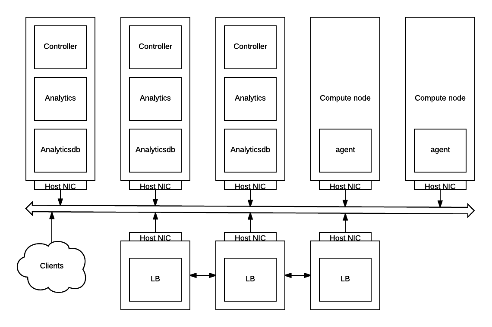

# Introduction
The purpose of this document is describe the requirements and design considerations for easy to use build and deployment
system along with containerization of contrail subsystems.

The system should allow build and deploy contrail services in set of containers that grouped the services based on 
functional and scalability requirements. It should provide easy interface to the end user and/or third party
orchestration systems to setup contrail system. It should also provide a very basic orchestration system that would be
usable with its native interface. 

# Problem statement
Contrail software is distributed as a set of few packages for each module. These packages have many depenedency chain and its own set of configuration parameters. This presents following deployment issues:

    1. Version of linux distribution in target system need to match exactly with the contrail sw is qualified on. Otherwise, installation may fail due to package depenedency mismatch. 

    2. If the deployment in #1 above succeeds and depenedent packages are picked from different mirror at customer site, then the installation is different than what the software was qualified with.

    3. Change in any package on target system has the risk of breaking contrail software. So any change is risky on the system and qualification of contrail and other components may be required.

    4. Currently provisioning tools (fuel, juju, puppet etc) directly interacts with services in file. Overtime these tools become too complex as it needs to know all the low level details of contrail services params without clear documentation.

In this project we intend to solve problems by distributing contrail sw as containers.

# Proposed solution

## Containerizing contrail services
This is an effort to containerize contrail subsystems. The idea is to reduce the complexity to deploy contrail and to
provide straight forward, simple way to deploy and operate contrail.

There should be number of docker containers which group functional contrail components together. They should provide a
per container configuration file in ini format to configure the services within the container - these container
configuration files should have high level configuration entries enough to configure all services within the container
and at the same time to mask internal service configuration complexity. These container configuration files should be
available on the host system (e.g /etc/contrailctl/controller.conf for controller, /etc/contrailctl/analytics.conf for 
analytics) and those should be mounted within specific containers.

In the initial effort, all contrail controller and vrouter agent application will be containerized. Openstack
containers would be implemented as a second step.

All the containers will be running with host network i.e without using docker bridge but all services within the
container will listen on host network interface itself. Some services like rabbitmq required extra parameters like host
based pid namespace (pid=host docker argument).

One of the important consideration we taken is that, this effort is starting with **ONLY** contrail components and
**NO** openstack. Idea is to start with **only** contrail components as core and add more components to it as needed.
This will enable to us develop the system that is composable - when we needed to use this with different cloud/container
orchestration systems like openstack, kubernetes, mesos etc.

Here are the initial containers would be and what they contains:

### contrail-controller
This container contain *all* contrail applications that makes an contrail SDN controller.
* config services: All config services like contrail api, config-nodemgr, device-manager, discovery, schema, svc-monitor
  and ifmap
* control services: All control services like contrail-control, control-nodemgr, contrail-dns, contrail-named
* webui: contrail-webui, contrail-webui-middleware
* config db (Cassandra)
* zookeeper
* rabbitmq
* redis for webui

### contrail-analytics
This container will have all contrail analytics services:
* alarm-gen
* analytics-api
* analytics-nodemgr
* contrail-collector
* query-engine
* snmp-collector
* contrail-topology

### contrail-analyticsdb
This will have cassandra to serve as analytics db as well as kafka.

### contrail-agent
This container contain the contrail agent and set of code to optionally compile and insert the vrouter kernel module.
So while starting contrail-agent will try to compile and insert the vrouter module, setup vhost0 interface, configure
vrouter-agent and manage vrouter-agent service.

This container would be optional for openstack based cloud systems as it may not be desired to run docker engine on
**all** compute nodes.

### loadbalancer
This will have all haproxy, keepalive etc which provide a load balancing and HA to the sytem. This is an optional
container, and people may choose to use their own loadbalancing systems. Note that any of the above containers will
have haproxy and keepalive setup in them to loadbalanced contrail serviece endpoints and we are taking that feature out
of them to dedicated container. Haproxy as part of vrouter agent is an exception that is used to implement LBAAS.

### More insights on requirements/design decisions

* We are going with multi-process containers and NOT going with per process containers at this moment because that would
  probably complicate the system more than currently.
* All logs and some data directories should be mounted. This will eliminate any performance issues and reduce the need
  of logging into the containers.
* Minimal configuration complexity: There should be a inifile based configuration - one per container and that should
  have all configurations for the applications running in that container. For example, all applications running in
  "controller" container should be configured with single inifile which would be available on the host (it will be
  mounted to the container so the changes wil be visible to the container and base host).
* There should be a toolset developed (we just named it as contrailctl) to handle the above mentioned configurations and
   some high level tasks such as mentioend below
   * One should be able to perform high level operations using this tool like add/remove a controller/compute nodes
   * Single inifile configuration should be synced with internal per application configurations - and it should support
     a bidirectional config conversions
   * May be some operational tasks like restarting certain applications etc
* Minimal external orchestration needs: The container should be self-contained and should handle all the "magic"
    to configure himself with minimal external orchestration needs - so ideally the job of external provisioning system
     should be as simple as create custom configuration in inifile per controller (e.g /etc/contrailctl/controller.conf)
     and start the containers. Rest of the things should be handled inside the containers
* We should have single tool used for all levels of build/deployment/provisioning - we decided that to be *ansible*
* Regarding containerization tool, we decided to go with docker

### Config management and automation system
This system uses ansible to provide automated service/configuration management within the container as well as to
provide a basic configuration and orchestration mechanism for the containers itself with an ansible native interface.

This should include ansible roles to setup contrail functional components like config, control, analytics, webui etc and
should have a set of high level playbooks to integrate these various ansible roles together to make a functional contrail
system. The system should read the configuration inputs from various functional component specific variable files and
should support running subset of tasks using ansible tags for example, one should be able to run config specific tasks
when desired.

Specific playbook should be implemented to provide basic support on orchestrating the containers with native
ansible interface for configurations like inventory and group_vars. This is an optional set of code in case one decided
to NOT to use any high level orchestration tools like contrail server manager, mirantis fuel etc.

The ansible code to install, configure, provisioning, and service management are named as contrail-ansible and kept in
separate repository. This code is responsible for all aspects of contrail container build, deployment and basic
container orchestration.

### contrailctl - toolset to configure, and operate contrail services running within the containers
This tool is supposed to be a handy toolset to the end users to manage the services and configuration within the container
, to get the service statuses, and high level operations like add/remove nodes etc. Here are the usecases for contrailctl

* Need to reconfigure existing contrail system
  In this case, one have to add/change the configruation in container specific config file (e.g /etc/contrailctl/controller.conf)
  and then run contrailctl to commit the configurations they made like "contrailctl config commit controller/config"
* Make sure internal service configurations are in sync with container config file
  In this case, one may run the command "contrailctl config sync"
* Add/remove controller node/container
* Get service status within the container etc

Please refer [contrailctl spec document](contrailctl.md) for details.

### Container image build system

Docker container images should be built using Dockerfile for each containers. Installation of contrail components within
and other tasks during build should be handled by the code in contrail-ansible. Also contrail-ansible and contrailctl
should be packaged inside the container so that they can be used while running the containers.

There should be a Makefile with appropriate targets to build the containers and other related artifacts. Please refer
[Contrail-docker image build process](docker-build.md) for details.

## Brief on basic changes when using docker containers

When we use containers, the entire deployment process will be completely seperated in two stages

1. build the container image
    In build stage, all the packages will be installed and some basic common configuration is done and build a generic
image which is ready to configure and will run every environment. So here we are going to create the container images
for each containers separately. In this stage build tool will have no idea about the environment where these
containers going to run. So it is like we create deb/rpm packages but here we get a high level sytem image which
have all those packages installed.

    This will reduce any package installation conflicts and other problems in customer environments as all these problems
will be handled in the build stage itself. These containers are all packages installed, prebuilt systems. All they
need is provide customer/environment specific configurations.

    Build is happening in our nightly build environment - so just after the package build and other stuffs, a container
image build job also be running, which consume those packages that built and create container images. These images
we saved as artifacts and will be shipped to the customers/end users.

2. deploy/provision the containers
In this stage, one will take the container images, and run them with appropriate inputs as mentioned in the previous
section. This comes setting up environment specific configurations, any orchestration, and starting the containers
from pre-built container images.

This happen in the environments directly where the system is going to setup.

## Related repositories

https://github.com/Juniper/contrail-docker: This repository will have all container building and supporting code.

https://github.com/Juniper/contrail-ansible: This repo will have all ansible code to support build, configure and
orchestrate the containers built and overall system setup.
