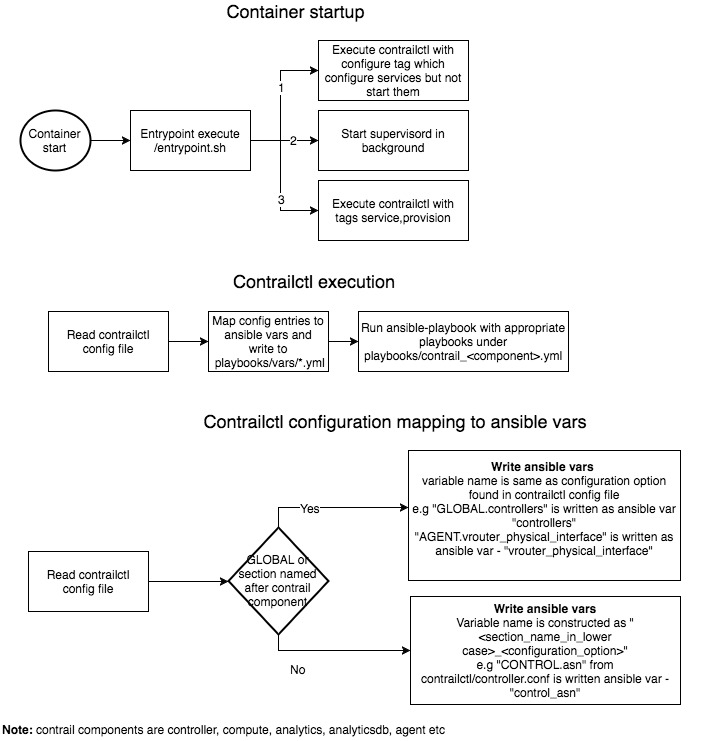

# 1. Introduction
contrailctl is a tool which help to configure the services inside the container to be in sync with container specific
config files. Also it is used to do certain high level operations like add/remove nodes, operational tasks like
start/stop/disable/enable components or services etc.

# 2. Problem statement
It is complex to provision and manage various services in contrail containers. There should be a simpler interface to
the user to provision and operate contrail services packaged in the containers. This tool should help on various
operational tasks like add/remove nodes, enable/disable components or services etc.

# 3. Proposed solution
contrailctl is the tool that is installed within the container which is driven by single ini based configuration file
per container e.g /etc/contrailctl/controller.conf for controller container. Any state changes of the services within
the container by this tools should be according to the configuration noted in the contrailctl config file for that
container. The contrailctl configuration files should be available on the node with a default location of /etc/contrailctl/
and the same are to be mounted to the containers so that any changes made to those files in the node is available
within the container.

This tool should support following operations:

* syncing the configurations in contrailctl configuration files to the services configurations within the container
* Enable/disable components/services within the containers
* Add/remove nodes of different type i.e controller, analytics, analyticsdb etc

contrailctl should implement subcommands to support all supported operations. E.g "contrailctl add node" to add a node.

Note: each contrail container should have separate contrailctl configuration files i.e
    controller - /etc/contrailctl/controller.conf
    analytics -  /etc/contrailctl/analytics.conf
    analyticsdb - /etc/contrailctl/analyticsdb.conf
    vrouter agent - /etc/contrailctl/agent.conf



## 3.1 Alternatives considered
None

## 3.2 API schema changes
None

## 3.3 User workflow impact
contrailctl is used within the container startup to configure and start the services within the container. Also users
can use this tool to do any above mentioned operations.

```
$ contrailctl config sync -h
usage: contrailctl config sync [-h] [-f CONFIG_FILE] -c
                               {controller,analyticsdb,analytics,agent,lb,kubemanager,mesosmanager,cephcontroller}
                               [-F] [-t TAGS]

optional arguments:
  -h, --help            show this help message and exit
  -f CONFIG_FILE, --config-file CONFIG_FILE
                        Master config file path
  -c {controller,analyticsdb,analytics,agent,lb,kubemanager,mesosmanager,cephcontroller}, --component {controller,analyticsdb,analytics,agent,lb,kubemanager,mesosmanager,cephcontroller}
                        Component[s] to be configured
  -F, --force           Whether to apply config forcibly
  -t TAGS, --tags TAGS  comma separated list of tags to runspecific set of
                        ansible code
  -v, --verbose         Verbose 
```
### Update service configurations within the container

Users can update the configurations by editing appropriate configuration file under /etc/contrailctl and can run
"docker exec <container name> contrailctl config sync -c <component name> ".
For example, if somebody want to update a service configuration within controller container, one can update
/etc/contrailctl/controller.conf within the node that hold the container, and then run below command to sync the change
to the services running within the container

```
$ docker exec controller contrailctl config sync -c controller -v

```
# 4. Implementation

In essence, contrailctl will handle below mentioned set of operations:

1. Sync the config entries there in /etc/contrailctl with running system inside the container - this is done by updating
ansible variables with respect to the configuration entries and running ansible inside the container to sync the
services in it with new configurations updated.
2. Do high level operations like add new node, remove node, disable certain service (e.g one wanted to migrate rabbitmq
to an external system) etc. In this case, contrailctl will do appropriate changes in config files in /etc/contrailctl
and sync the services inside the container with the configurations.

In any given time, config files in the /etc/contrailctl should be source of truth, which may be made possible with

1. using an auto sync mechanism - like poll these files for changes in certain frequency and run the update to services
 inside the container.
2. a manual sync subcommand: in this case, once somebody change the contrailctl config files manually, he have to run
sync subcommand (like "contrailctl config sync") which will sync the configs to the services inside the container

NOTE: In case of #1, we would have handle any situation when all individual services get restarted because of asynchronous
 operations, which may cause a downtime. This may be handled by adding some coordination code, which may be done later
 In case of #2, there are chances that users updated the config files and missed to do manual "sync", and this may cause
 inconsistencies in the internal service configurations.

### contrailctl to manage files under /etc/contrailctl/
This would be required when somebody decided to run contrailctl subcommands to do some high level operations (as
mentioned above), without editing /etc/contrailctl files. In this case contrailctl to do

* Verify the consistency of /etc/contrailctl/ files
    * Any syntax error in existing files before a change
    * Verify any uncommited changes - i.e any configurations in /etc/contrailctl that are NOT applied to the services/
    service configurations
* If verification is successful, add appropriate changes in /etc/contrailctl config files to make the operation successful
* Then run config sync code to sync the configuration with internal services

### contrailctl to do config sync for the config files under /etc/contrailctl
This is to make sure the services inside the containers are consistent with the configuration under /etc/contrailctl.
This may be happen automatically in certain (configurable) duration, and/or manually using "config sync" subcommand.

Essentially what this operation does is that, it will read the config files from /etc/contrailctl and update ansible
variables in various groupvars/ yaml files appropriately and ansible-playbook reconfigure the services and restart them.

### More detail about internal working
In its basic form, contrailctl does below things:
* Read container specific master_config file from /etc/contrailctl
* Map those configs to internal ansible variable mappings based out of map.*_PARAM_MAP - which is a dict to
  resolve one-to-one or one-to-many mappings for entries in master_config. Default mapping is <section name>_<param name>.
  For example, if /etc/contrailct/controller.conf has an entry "server_port" in the section "DISCOVERY", the default mapping
  in case there is no map entries in in map.CONTROLLER_PARAM_MAP, is discovery_server_port. But in case it map to
  "discovery_port" in map dict, it will map to that param.

  maps.*_PARAM_MAP may have one-to-many mappings for example, server_list in GLOBAL section will have one-to-many maps
  as server_list would add/update multiple ansible variables - like rabbit_servers, controller_servers, configdb_servers etc

* Verify if there any config is updated, Run below steps in case of configs updated,
    * Write mapped variables to container specific variable files in contrail-ansible - ansible would be reading from the
 variables from these files - by default they are kept in /contrail-ansible/playbooks/vars/<high level component name>.yml
 e.g /contrail-ansible/playbooks/vars/contrail_controller.yml.
    * Run ansible-playbook to update the service configs within the container
* In case there is no configs get updated, just exit with appropriate message

## contrailctl operations
Here are the major operations identified in initial stage.

1. contrailctl config sync  - This is to sync the entire configs from master_configs within
    /etc/contrailctl to service configs within the container. Optional section and param will restrict the data to be
    synced to specific section/param. Optional force option would do ansible run even if there is no config change to be
    synced.
```
$ contrailctl config sync -c controller -F -v 

PLAY [Setup Controller] ********************************************************

TASK [setup] *******************************************************************
ok: [localhost]

TASK [include_vars] ************************************************************
ok: [localhost]

TASK [common : make sure /var/run/utmp exist] **********************************
ok: [localhost]
...........
............
............
```
2. contrailctl config validate - This subcommand is to validate contrailctl configuration found under /etc/contrailctl/

```
$  contrailctl config validate -c controller
All configurations are valid

$ contrailctl config validate -c analytics
All configurations are valid
```

# 11. References
* [Contrailctl configuration examples](https://github.com/Juniper/contrail-docker/tree/master/tools/python-contrailctl/examples/configs)
